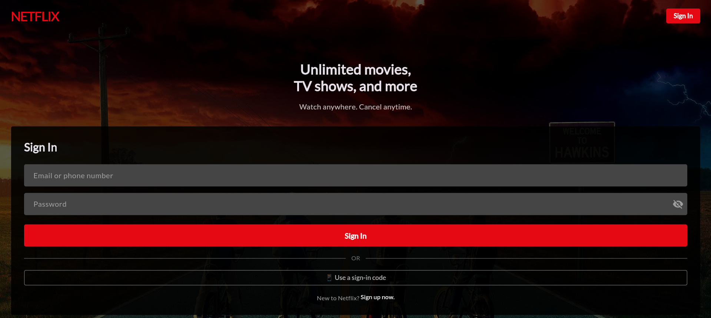
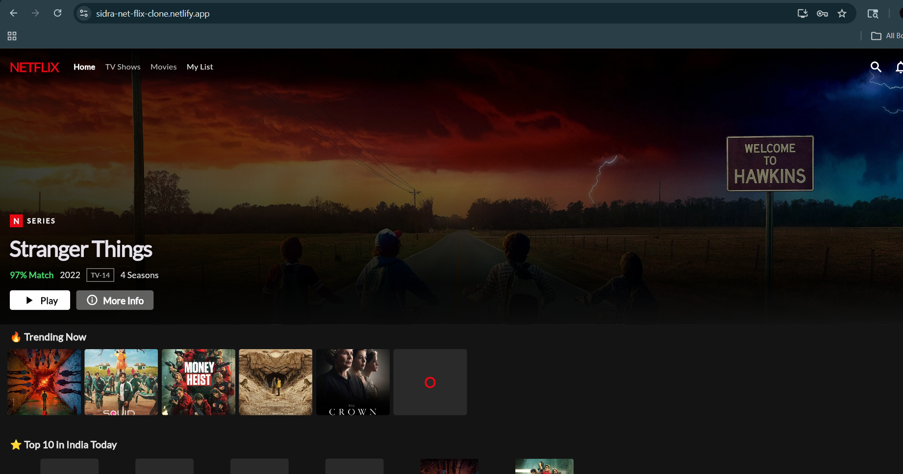
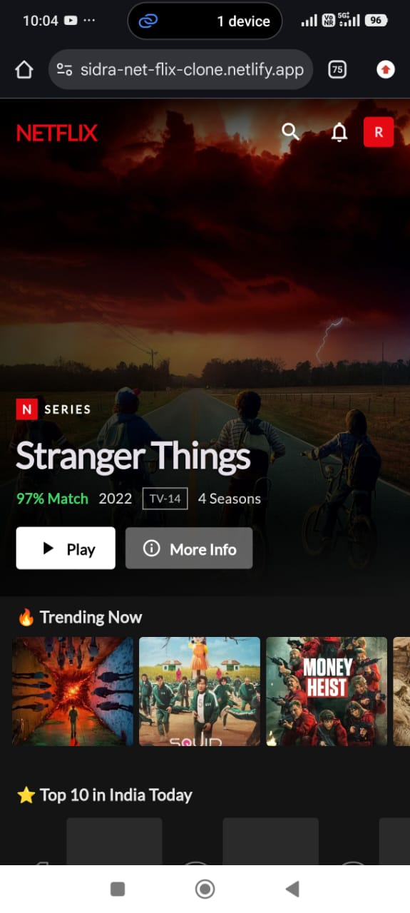
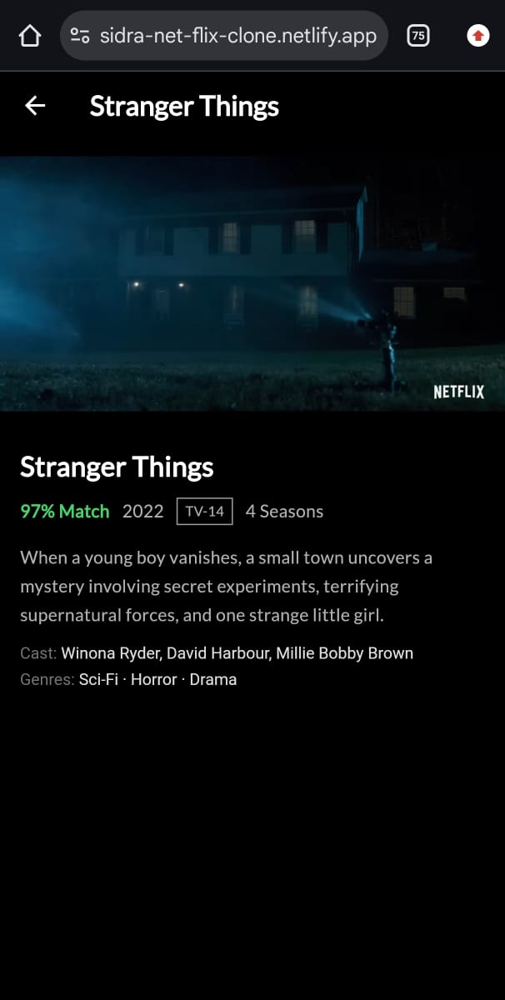

# 🎬 Netflix Clone

## 🌐 Live Demo  
👉 https://sidra-net-flix-clone.netlify.app/  
A live web version of the Netflix-style app where you can explore UI and features directly.

---

## 📸 Screenshots  
Below are some UI previews of the application:

---

---

---

---

---

## 📌 Project Details  
This project is a Netflix-inspired application built using Flutter.  
It focuses on replicating the core UI and user experience of Netflix including authentication, profile selection, and content browsing.

- Login & Profile selection flow  
- Movie browsing with categorized rows  
- Clean Netflix-like UI design  
- Integrated video playback  
- Works on both mobile and web  

---

## ⚙️ Tech Stack  
Technologies used in this project:

- Flutter  
- Dart  

---

## 👩‍💻 Author  
Sidra Shaikh  
